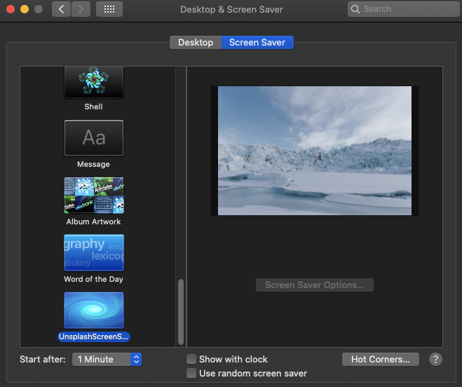

# Unsplash Screen Saver
* Screensaver with images from [Unsplash](https://unsplash.com).
* changing image every 5 minutes.

## How to install
1. Download [UnsplashScreenSaver.saver](https://github.com/kenta-ja8/unsplash-screen-saver/releases)
2. Double click it and it will appear in System Preferences:

## Test environment
* MacBookPro2017 Catalina

## Inspired by
1. [leonspok/Irvue-Screensaver](https://github.com/leonspok/Irvue-Screensaver)
2. [macOSのスクリーンセーバーをHTML・CSS・JSで作る (Swiftスキル不要)](https://qiita.com/suin/items/83ebaf96caa2c13c8b2f)

